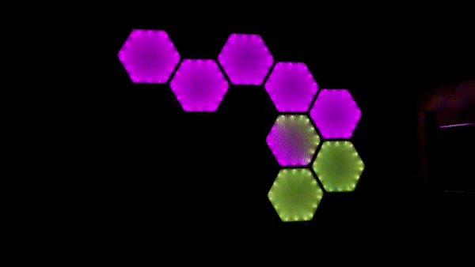

# Hex Lights

## TL;DR 

Make one of these:



## The deets

This is not an original idea, there are some existing commercial products like this such as those sold by [nanoleaf](https://nanoleaf.me). 

But why spend €200 on something when you can build it yourself for more money and _way_ more time?

- I have a 3D printer
- It's fun
- I have a 3D printer
- It's a learning experience
- I have a 3D printer

The goal of this project was to create a modular set of lights that I could hang on my wall. Overall it was a partial success - the lights are semi-modular, as in: they are modular once. Assembly in my case required some glue which makes the design _slightly_ less modular. They are pretty though (src: the gif above).

## Materials

In case the previous section wasn't clear, a 3D printer is required.

You will need: 

- Clear filament
- Black filament 
- A roll of 0.34mm^2 (22awg) wire for power (it's fine unless you're pumping a lot of current through it. My setup is 3A max)
- Some thinner wire for data (I used wire from an old telephone cable because I had it to hand)
- An ESP8266
- A 12v power supply 
- 5v power regulator for the ESP, otherwise the magic smoke will be released (I used a buck-boost converter I had lying around)
- Addressable RGB strip (I used 12v @ 60 LEDs/m. The internal length of each wall is 10cm with supports designed with this in mind)
- Much patience

## What do I print?

1 [container](stls/cont.stl) and related [pin](stls/cont_pin.stl). This is where the ESP and voltage regulator live.

1 [top cover](stls/common_top.stl), [bottom hexagon](stls/common_bottom.stl) and [wall pin](stls/wall%20pin.stl) for each body.

### Wtf are those filenames?

This was a _Brilliant Idea™_ I had while exporting the files.

In the file name:

- 1 indicates the existence of a face that can connect to another hexagon
- 0 indicated that the face cannot be connected
- Faces are labelled clockwise starting from the top (see example below)

```
  _**_      _**_       _**_
 /    \    /    \*    /    \
/      \  /      \*  /      \
\      /  \      /   \      /*
 \____/    \____/     \____/*

100000    110000      101000

etc.

* indicated a connectable face
```

### Back to printing?

The hexagon and container bodies should be printed in black filament. Everything else should be printed in clear filament (I used PETG). Unless you are some sort of sorcerer/ess, the 'clear' filament should come out milky - this is good.

### Hardware in summary?

Print and assemble. 

Electronics live in [container](stls/cont.stl), LEDs live in body(s).

There are pins in the print to help locate the LEDs. In the corners of the hexagon the space is deliberately left so the strip can be bent towards the centre, this compensates for some printer inaccuracy.

The data wire can be routed through the channels slightly below the LEDs so it doesn't interfere.

I recommend starting and ending each section of the LED strip in the corner of the hexagon (makes life easier and you get the neat pattern in the gif at the top of the page when lighting LEDs sequentially).

The [wall pin](stls/wall%20pin.stl) exists because I never considered how to mount this thing to the wall. The answer was to superglue these pins between the hexagons and use 3M command strips. This is not an ideal solution and this bit should be better incorporated into the design.

Power the ESP using the voltage converter @ 5v or 3.3v. I let the magic smoke out of one chip because I mixed up some wires. Don't be like me. You can power the chip at 3.3v directly but I only had dev boards lying about so I used 5v, the energy loss is minimal in this use case. The LED strip will most likely want a 5v logic level but the ESPs 3.3v should be enough if the distance isn't too long.

## Software

I use [WLED](https://github.com/Aircoookie/WLED) on the ESP connected to my local [Home Assistant](https://www.home-assistant.io/) server to control the lights.
